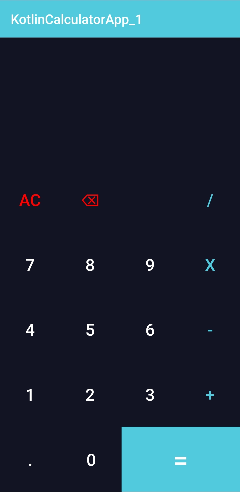
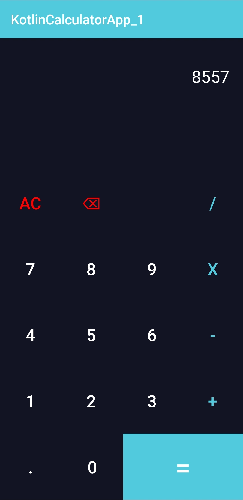
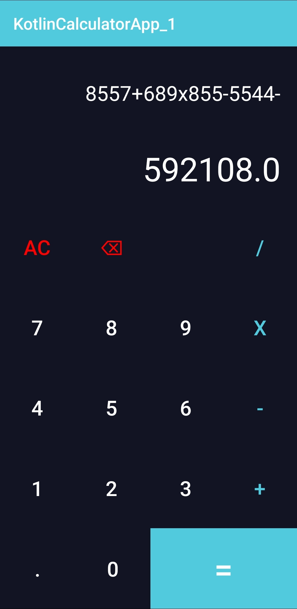

# <span style="color:#51cade">**Пет-проект "Калькулятор на Kotlin"(ru)**</span>
* Использованы ```LinearLayout``` (неэффективно если в внутри Layout несколько Layout, но в данном случае их немного и на производительность не влияет).
* Также все цвета хранятся в ```color.xml``` и вызываются через ```"@color/*"```, где **"*"** - название цвета.
* Создан <span style="color:#51cade">**стиль**</span> для каждой кнопки в ``styles.xml``.
* Все кнопки и операторы по событиям клика вызывают функцию NumberAction и OperationAction, кроме кнопки <span style="color:#51cade">"="</span>, <span style="color:#51cade">"AC"</span>, <span style="color:#51cade">"⌫"</span>.
* Все ID от View сохраняются в MainActivity через ``findViewById(R.id.*)``, где **"*"** - название ID.
* Реализованы функции для расчёта введенных чисел с операторами.

# <span style="color:#51cade">**Pet-project "Calculator in Kotlin"(en)**</span>
* Used ```LinearLayout``` (ineffective if there are several Layouts inside the Layout, but in this case there are few of them and does not affect performance).
* Also, all colors are stored in ```color.xml``` and called via ```"@color/*"```, where **"*"** is the name of the color.
* Created a <span style="color:#51cade">**style**</span> for each button in ``styles.xml``.
* All buttons and operators on click events call the NumberAction and OperationAction functions, except for the <span style="color:#51cade">"="</span>, <span style="color:#51cade">"AC"</span>, <span style="color:#51cade">"⌫"</span>.
* All IDs from View are saved in MainActivity via ``findViewById(R.id.*)``, where **"*"** is the name of the ID.
* Implemented functions for calculating entered numbers with operators.


